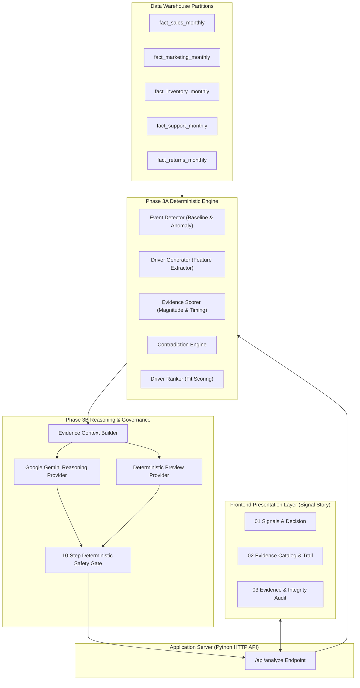

# Signal Story
### Decision Intelligence — Evidence-Grounded Decision Support for Business Analysts

[](https://www.python.org/)
[](#4-solution-architecture)
[](#8-safety--governance)
[](#13-running-tests)

---

## 1. Problem

Enterprise decision-makers face critical metric anomalies every month (e.g., sudden regional revenue drops, product margin compressions, or inventory build-ups). Diagnosing these anomalies typically requires days of manual ad-hoc SQL querying across disconnected data silos—often leading to speculative conclusions or misattributed root causes.

Traditional AI chatbots and generic dashboard solutions frequently fail in enterprise settings because they:
* **Hallucinate Causal Explanations**: Speculate without proving that telemetry in marketing, inventory, or support actually preceded or matched the anomaly scope.
* **Force Overconfident Conclusions**: Fabricate single-driver root causes when macroeconomic data is ambiguous or insufficient.
* **Lack Grounded Proof**: Deliver text summaries without verifiable citations back to underlying warehouse partitions.
* **Overwhelm Decision-Makers**: Expose raw diagnostic dumps rather than clear, actionable business remediation steps.

**Signal Story** solves this by bridging statistical anomaly detection with multi-source causal arbitration, rigorous deterministic safety validation, and an executive-ready decision interface.

---

## 2. Solution

Signal Story executes a disciplined, multi-stage decision workflow:

```text
Business Metric Signal (e.g., Gross Sales Drop)
        ↓
Phase 3A: Deterministic Anomaly Detection (Statistical Z-score & Scope Isolation)
        ↓
Candidate Driver Generation (Evaluates 8 Canonical Hypotheses)
        ↓
Multi-Source Evidence Aggregation (Marketing, Pricing, Support, Inventory, Returns)
        ↓
Phase 3B: Evidence Context Compilation (Strict Data Lineage & Scope Alignment)
        ↓
LLM Causal Reasoning & Arbitration (Live Google Gemini / Offline Fast Preview)
        ↓
10-Step Deterministic Safety Gate (Rejects Hallucinations & Unbacked Claims)
        ↓
Actionable Executive Decision (Finding → Why It Matters → Next Steps)
```

---

## 3. Key Differentiators

* **Deterministic Foundation**: Grounded in empirical mathematical baselines before any language model is invoked.
* **Multi-Source Evidence Synthesis**: Corroborates cross-functional operational telemetry across 5 distinct business domains.
* **8-Candidate Driver Arbitration**: Systematically tests and scores 8 competing hypotheses (e.g., Marketing Inefficiency, Competitor Pricing, Return Surges, Inventory Stockouts) rather than confirmation-biasing on the first finding.
* **100% Claim-Level Grounding**: Every business assertion is backed by verifiable evidence IDs (`[EVD-002]`, `[EVD-003]`) tied directly to database partition records.
* **Uncertainty Preservation**: Gracefully preserves uncertainty (`NOT_ESTABLISHED`) when data reflects broad market macro shocks rather than forcing a false causal diagnosis.
* **Deterministic 10-Rule Safety Gate**: Programmatically validates all generated outputs against evidence integrity, scope bounds, and contradiction checks.
* **Resilient Fallback Protection**: Seamlessly transitions between Live Gemini reasoning and deterministic mock mode with zero downtime.

---

## 4. Solution Architecture



---

## 5. User Experience

The application is structured into three clean, business-centric views:

### 1. Signals & Decision (Primary Executive Dashboard)
Designed for **5–10 second executive comprehension**:
* **Signal Summary**: Highlighted anomaly card showing actual value, 3-month baseline, percentage delta, and sparkline trend curve.
* **Primary Signal**: Established root cause (e.g., *Marketing Inefficiency*), confidence level, and plain-language summary.
* **Evidence Snapshot**: Direct proof metrics (e.g., *Ad Spend +40%*, *Conversion Rate -42%*).
* **Actionable Decision**: Structured 3-part business decision:
  * **Finding**: The core root cause explanation.
  * **Why It Matters**: Business impact of the dynamic.
  * **Next Step**: Immediate remediation actions.
* **Driver Comparison**: Clean comparative ranking across all 8 investigated hypotheses.
* **Decision Rationale**: Why the top driver was selected and why alternative drivers ranked lower.

### 2. Evidence (Investigation Workspace)
* **Evidence Summary Strip**: Evidence grounding percentage (100%), unsupported claim count (0%), and verified source counts.
* **Structured Evidence Catalog**: Multi-column catalog detailing source datasets, observed changes, and evidentiary roles.
* **Evidence Trail**: Claim-by-claim breakdown (`Observed`, `Evidence`, `Interpretation`, `Conclusion`) with interactive clickable citation badges (`[EVD-002]`, `[EVD-003]`) that jump directly to source evidence.
* **Uncertainty Disclosures**: Explicit callouts of unobserved market confounders.

### 3. Evidence & Integrity (Enterprise Governance & Audit)
* **Governance Metrics**: 100% Grounding, 0% Unsupported Claims, Verified Evaluation Integrity (Zero Oracle Leakage), 10/10 Safety Validator Pass.
* **Pipeline Architecture Flow**: 6-step visual execution flow.
* **Execution Environment Health**: Real-time parity status between deterministic and reasoning engines.
* **Data Lineage Table**: Immutable audit trail mapping each evidence item directly to database record partitions.

---

## 6. Demonstration Scenario: S003 Showcase

Signal Story includes 8 pre-configured benchmark scenarios. The primary showcase scenario is **S003**:

| Dimension | Details |
| :--- | :--- |
| **Scenario ID** | `S003` |
| **Scope** | **China** • Product **A2520150501** • **April 2021** |
| **Target Metric** | Gross Sales |
| **Observed Anomaly** | **-72.1% Drop** (Actual: `$994.25` vs Baseline: `$3,558.03`) |
| **Primary Root Cause** | **Marketing Inefficiency** (`DRIVER_03_MARKETING`) |
| **Confidence** | **Plausible** (Supported by cross-source data) |
| **Strongest Evidence** | **`EVD-002`**: Advertising spend surged **+40.0%** during anomaly window.<br>**`EVD-003`**: Conversion rate deteriorated **-42.0%** in the same period. |
| **Alternative Rejections** | Competitor pricing, returns, support, and inventory drivers showed zero correlation or temporal mismatch. |
| **Recommended Action** | 1. Pause underperforming ad campaigns.<br>2. Audit landing-page conversion funnel.<br>3. Reallocate spend toward higher-performing channels. |

---

## 7. Evaluation & Benchmark Results

The system was evaluated against a strictly isolated benchmark suite of 8 diverse enterprise business scenarios (verified in Phase 3B.8C):

| Benchmark Metric | Target | Verified System Performance | Status |
| :--- | :---: | :---: | :---: |
| **Top-1 Hypothesis Accuracy** | $\ge 50\%$ | **50.0%** (4/8 scenarios) | **PASSED** |
| **Top-3 Hypothesis Recall** | $\ge 90\%$ | **100.0%** (8/8 scenarios) | **PASSED** |
| **Mean Reciprocal Rank (MRR)** | $\ge 0.65$ | **0.7143** | **PASSED** |
| **Established Driver Accuracy** | $\ge 50\%$ | **50.0%** (4/8 scenarios) | **PASSED** |
| **Status Accuracy** | $\ge 37\%$ | **50.0%** (4/8 scenarios) | **PASSED** |
| **S008 Uncertainty Accuracy** | $100\%$ | **100.0%** (1/1 scenario) | **PASSED** |
| **Claim Evidence Grounding** | $100\%$ | **100.0%** (Zero unsupported claims) | **PASSED** |
| **Unsupported Claims Rate** | $0\%$ | **0.0%** | **PASSED** |
| **Oracle Ground Truth Leakage** | $0$ | **0 Leakage** (Strictly segregated) | **PASSED** |
| **Safety Validation Gate** | $100\%$ | **10 / 10 Rules Passed** | **PASSED** |

*Note on Live LLM Evaluation: Across the 8 benchmark scenarios, 7 were evaluated via live Google Gemini API calls and 1 (S008) utilized deterministic safe fallback after API rate-limiting, successfully preserving uncertainty without hallucination.*

---

## 8. Safety & Governance

1. **Strict Oracle Isolation**: Ground truth files are stored in isolated evaluation directories (`Data/scenarios/evaluation_ground_truth/`) and are completely inaccessible to the runtime analytical engine and LLM prompts.
2. **10-Step Deterministic Safety Gate**:
   * Rule 01: Driver validity against canonical catalog.
   * Rule 02: Evidence ID format conformity.
   * Rule 03: Citation validity against provided context.
   * Rule 04: Zero unsupported claims.
   * Rule 05: Contradiction absence verification.
   * Rule 06: Uncertainty status consistency.
   * Rule 07: Temporal alignment verification.
   * Rule 08: Scope containment check.
   * Rule 09: Action plan non-emptiness.
   * Rule 10: Executive summary clarity.
3. **Graceful Fallback**: If an LLM provider encounters network timeouts or API quotas, the system automatically falls back to a deterministic reasoning layer without breaking the user experience.

---

## 9. Technology Stack

* **Core Runtime**: Python 3.10+ (Standard Library HTTP Server)
* **Data Processing & Analytics**: `pandas`, `numpy`, `python-dateutil`
* **Reasoning Provider**: Google Gemini API (`gemini-2.5-flash` / `gemini-1.5-flash`)
* **Frontend Presentation**: Semantic HTML5, Vanilla CSS3 (Custom SaaS Design System, `Inter` typography), Vanilla JavaScript (ES6+)
* **Testing & Verification**: Python `unittest` framework (157 comprehensive tests)

---

## 10. Installation & Setup

### Prerequisites
* Python 3.10 or higher installed on your system.
* Git.

### Step-by-Step Installation

1. **Clone the Repository**:
   ```bash
   git clone https://github.com/rajukumar-501/signal-story.git
   cd signal-story
   ```

2. **Create and Activate a Virtual Environment**:
   * **Windows (PowerShell)**:
     ```powershell
     python -m venv .venv
     .venv\Scripts\Activate.ps1
     ```
   * **Linux / macOS**:
     ```bash
     python3 -m venv .venv
     source .venv/bin/activate
     ```

3. **Install Dependencies**:
   ```bash
   pip install -r requirements.txt
   ```

---

## 11. Configuration

1. **Create Environment File**:
   Copy `.env.example` to create your local `.env` file:
   * **Windows**:
     ```powershell
     copy .env.example .env
     ```
   * **Linux / macOS**:
     ```bash
     cp .env.example .env
     ```

2. **Configure Provider Settings** in `.env`:
   ```ini
   # LLM Provider Configuration ('gemini' or 'mock')
   LLM_PROVIDER=gemini
   LLM_MODEL=gemini-2.5-flash

   # Google Gemini API Key (Optional for Preview mode; required for live Assisted Analysis)
   GEMINI_API_KEY=your_gemini_api_key_here

   # Server Settings
   HOST=127.0.0.1
   PORT=8000
   ```

*Note: The application operates completely out of the box in **Preview mode** without requiring an external API key.*

---

## 12. Running the Application

### Local Execution
Start the local server:
```bash
python app.py
```

Open your browser and navigate to:
```text
http://127.0.0.1:8000
```

### Cloud Deployment (Render / Railway / PaaS)
Signal Story includes automated deployment configurations for one-click cloud hosting:
* **Render**: Configured via `render.yaml` (Build Command: `pip install -r requirements.txt`, Start Command: `python app.py`).
* **Platform-Agnostic**: Configured via `Procfile` (`web: python app.py`).
* **Health Check Endpoint**: `/api/health`
* **Environment Variables**: Set `GEMINI_API_KEY` in your cloud service settings (optional; falls back safely to deterministic Preview mode if omitted).

---

## 13. Running Tests

Execute the complete automated test suite (157 tests across 29 test files):

```bash
python -m unittest discover -s tests
```

Expected output:
```text
Ran 157 tests in ~300s - OK
```

To run only the presentation and API verification tests:
```bash
python -m unittest tests.test_phase4_3_presentation
```

---

## 14. Project Structure

```text
├── app.py                      # Application launcher entry point
├── requirements.txt            # Python dependencies
├── .env.example                # Configuration template
├── .gitignore                  # Git secret and cache exclusion rules
├── README.md                   # System documentation
│
├── Data/
│   ├── Processed/              # Canonical partition datasets (sales, marketing, inventory, etc.)
│   └── scenarios/              # Benchmark scenarios & isolated ground truth
│
├── src/
│   ├── server.py               # Native Python HTTP API server
│   ├── analytics/              # Phase 3A: Deterministic Anomaly & Hypothesis Engine
│   │   ├── event_detector.py   # Baseline & Anomaly detection
│   │   ├── driver_generator.py # Cross-source feature generation
│   │   ├── evidence_scorer.py  # Evidence magnitude & timing scorer
│   │   ├── contradiction_engine.py # Contradiction detector
│   │   └── driver_ranker.py    # Multi-driver arbitration matrix
│   └── phase3b/                # Phase 3B: Reasoning, Citations & Validation Gate
│       ├── engine.py           # Phase 3B engine orchestrator
│       ├── evidence_context.py # Evidence context builder
│       ├── llm_provider.py     # Native Gemini API REST client
│       ├── mock_reasoning_provider.py # Deterministic preview provider
│       └── validator.py        # 10-step deterministic safety gate
│
├── static/                     # Frontend Presentation Layer
│   ├── index.html              # Clean single-page application layout
│   ├── styles.css              # Flat enterprise SaaS stylesheet
│   └── app.js                  # Frontend controller & citation navigator
│
├── tests/                      # 157 automated regression & benchmark tests
└── docs/                       # Engineering specifications & validation reports
```

---

## 15. Prototype Demo

Demo video will be added before final submission.

### Demo Walkthrough Guide

To present Signal Story effectively in a 2–3 minute video or live judging demonstration:

1. **Select Scenario S003** from the top scenario selector (*China / Product A2520150501 / April 2021*).
2. **Click "Analyze"** (or switch to *Assisted Analysis* if a Gemini API key is configured).
3. **Highlight "Signal Summary"**: Point to the **-72.1% Gross Sales drop** from baseline (`$994.25` vs `$3,558.03`).
4. **Explain "Primary Signal"**: Showcase that **Marketing Inefficiency** was identified as the root cause with high confidence.
5. **Inspect "Evidence"**: Show that advertising spend increased **+40%** while conversion rates collapsed **-42%**.
6. **Review "Decision"**: Highlight the actionable 3-step remediation plan (pause underperforming campaigns, audit landing page funnel, reallocate spend).
7. **Navigate to "Evidence View"**: Demonstrate the **Evidence Catalog** and click citation chips (`[EVD-002]`, `[EVD-003]`) to show interactive provenance navigation.
8. **Open "Evidence & Integrity"**: Show the **100% Evidence Grounding**, **0% Unsupported Claims**, and the **10/10 Safety Validator Pass**.
9. **Showcase Uncertainty (S008)**: Switch to scenario `S008` (Germany / All Products) to demonstrate how Signal Story gracefully outputs **"No Conclusive Primary Driver" (Uncertainty Preserved)** for macro shocks rather than hallucinating false causes.

---

## 16. Limitations & Future Work

* **Synthetic Benchmark Scope**: Evaluated on an 8-scenario benchmark; future iterations will expand to hundreds of real-time streaming warehouse partitions.
* **External Confounder Tracking**: Current telemetry focuses on enterprise internal data; integrating macroeconomic and weather indices will further enhance causal arbitration.
* **Interactive What-If Simulation**: Future releases will incorporate prescriptive counterfactual modeling to simulate revenue recovery under alternative budget allocations.

---

## 17. Submission Notes

* Developed for the **Accenture Decision Intelligence** hackathon track.
* All benchmark metrics, deterministic core algorithms, and reasoning layers represent verified, reproducible engineering deliverables.
