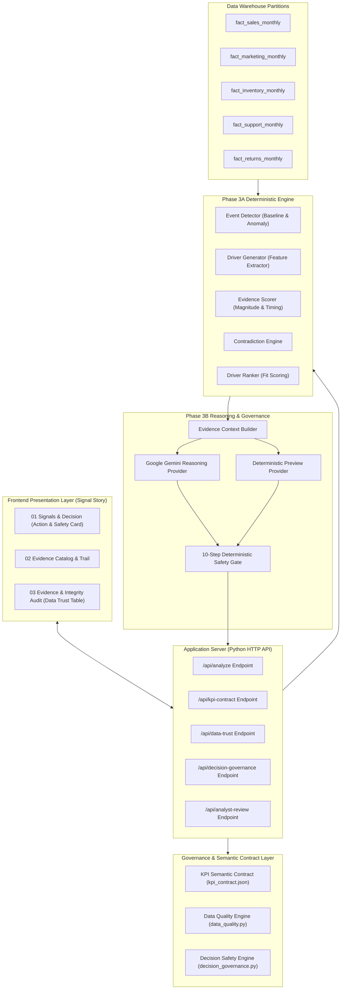

# Signal Story
### Decision Intelligence — Evidence-Grounded Decision Support for Business Analysts

[](https://www.python.org/)
[](#4-solution-architecture)
[](#8-safety--governance)
[](#8-safety--governance)
[](#13-running-tests)

> 📦 **GitHub Repository**: [https://github.com/rajukumar-501/signal--story](https://github.com/rajukumar-501/signal--story)

---

## 1. Problem

Enterprise decision-makers face critical metric anomalies every month (e.g., sudden regional revenue drops, product margin compressions, or inventory build-ups). Diagnosing these anomalies typical[...]

Traditional AI chatbots and generic dashboard solutions frequently fail in enterprise settings because they:
* **Hallucinate Causal Explanations**: Speculate without proving that telemetry in marketing, inventory, or support actually preceded or matched the anomaly scope.
* **Force Overconfident Conclusions**: Fabricate single-driver explanations when macroeconomic data is ambiguous or insufficient.
* **Lack Grounded Proof**: Deliver text summaries without verifiable citations back to underlying warehouse partitions.
* **Lack Multi-Source Connected KPIs**: Present isolated metrics without corroborating business volume and operational driver telemetry.
* **Lack Prioritization Feedback Loops**: Human reviews are static checkboxes that never inform future driver ranking.
* **Lack Persona Adaptation & Entitlement Security**: Deliver one-size-fits-all output regardless of executive vs technical persona or sensitive data clearance.

**Signal Story** solves this by bridging statistical anomaly detection with multi-source causal arbitration, connected multi-source KPI evidence layers, bounded context-aware analyst feedback lear[...]

---

## 2. Solution

Signal Story executes a disciplined, multi-stage decision workflow:

```text
Business Metric Signal (e.g., Gross Sales Drop)
        ↓
Phase 3A: Deterministic Anomaly Detection (Statistical Z-score & Scope Isolation)
        ↓
Candidate Driver Generation (Evaluates 8 Canonical Hypotheses)
        ↓
Phase 6A: Multi-Source Connected KPI Evidence Layer (ERP Sales + Marketing Telemetry)
        ↓
Phase 3B: Evidence Context Compilation (Strict Data Lineage & Scope Alignment)
        ↓
LLM Causal Reasoning & Arbitration (Live Google Gemini / Offline Fast Preview)
        ↓
10-Step Deterministic Safety Gate (Rejects Hallucinations & Unbacked Claims)
        ↓
Phase 6I: Context-Aware Feedback Learning & Operational Prioritization Calibration
        ↓
Phase 6B/6F: Persona Adaptation & Role-Based Entitlement Redaction
        ↓
Actionable Decision Delivery (Executive Briefing vs Deep Analytical Trace)
```

---

## 3. Key Differentiators

* **Deterministic Foundation**: Grounded in empirical mathematical baselines before any language model is invoked.
* **Connected KPI Story**: Deterministically aligns 5 connected metrics (Gross Sales, Order Volume, Marketing Spend, Conversion Rate, CTR) across distinct warehouse tables, grains, and cadences.
* **Multi-Source Integration Spec**: Machine-readable specification (`source_integration_spec.json`) mapping 10 canonical datasets across 5 business domains.
* **Persona Intelligence**: Tailors narrative depth and decision rights for **Executive / Business Leader** vs **Domain / RevOps Analyst** while referencing identical governed ground truth.
* **Low-Confidence & Abstention State**: Gracefully detects insufficient or contradictory telemetry (Scenario S008) and displays `NO ACTION RECOMMENDED UNTIL VALIDATED` with required next evidence.
* **Sparse History & New Launch Benchmark**: Detects products with `< 3 months` history (Scenario S009) and applies explicit peer category baseline fallbacks with full limitation disclosure.
* **Role-Based Entitlement & Redaction**: Enforces access control for **Executive** (full), **Domain Analyst** (telemetry), and **Restricted User** (masks sensitive financial numbers).
* **LLM vs Non-LLM Processing Classification**: Formal contract and UI panel guaranteeing that all mathematical truth, 40 DQ checks, and 10 safety gates are 100% deterministic (Non-LLM).
* **Runtime Telemetry & Cost Engine**: Real runtime instrumentation measuring execution latencies (ms), model calls, token usage, and unit cost per insight.
* **Context-Aware Feedback Learning Loop**: Deterministic, bounded ($[-0.15, +0.15]$), context-isolated feedback loop that dynamically adjusts future candidate driver prioritization without modifying [...]

---

## 4. Solution Architecture



---

## 5. User Experience

The application is structured into three clean, business-centric views:

### 1. Signals & Decision (Primary Executive Dashboard)
Designed for **5–10 second executive comprehension**:
* **Signal Summary**: Highlighted anomaly card showing actual value, 3-month baseline, percentage delta, and sparkline trend curve.
* **Primary Signal**: Supported driver diagnosis (e.g., *Marketing Inefficiency*), confidence level, and plain-language summary.
* **Evidence Snapshot**: Direct proof metrics (e.g., *Ad Spend +40%*, *Conversion Rate -42%*).
* **Decision Support & Safety (Card 4)**:
  * **Finding**: The core supported driver explanation.
  * **Why It Matters**: Business impact of the dynamic.
  * **Recommendation**: Immediate remediation action plan.
  * **Before Acting**: Structured prerequisite checklist for operational verification.
  * **Operational Metadata**: Affected business area and required domain owner sign-off.
  * **Human Oversight**: Interactive Analyst Review Bar (`[Approve Recommendation]`, `[Mark Reviewed]`, `[Request Evidence]`, `[Reject]`).
* **Driver Comparison**: Clean comparative ranking across all 8 investigated hypotheses.
* **Decision Rationale**: Why the top driver was selected and why alternative drivers ranked lower.

### 2. Evidence (Investigation Workspace)
* **Evidence Summary Strip**: Evidence grounding percentage (100%), unsupported claim count (0%), and verified source counts.
* **Structured Evidence Catalog**: Multi-column catalog detailing source datasets, observed changes, and evidentiary roles.
* **Evidence Trail**: Claim-by-claim breakdown (`Observed`, `Evidence`, `Interpretation`, `Conclusion`) with interactive clickable citation badges (`[EVD-002]`, `[EVD-003]`) that jump directly to sour[...]
* **Uncertainty Disclosures**: Explicit callouts of unobserved market confounders.

### 3. Evidence & Integrity (Enterprise Governance & Audit)
* **Data Quality & Trust Governance**: 40 deterministic checks across 9 canonical datasets with status, freshness, and completeness metrics.
* **Governance Metrics**: 100% Grounding, 0% Unsupported Claims, Verified Evaluation Integrity (Zero Oracle Leakage), 10/10 Safety Validator Pass.
* **Pipeline Architecture Flow**: Visual execution flow across deterministic and LLM stages.
* **Data Lineage Table**: Immutable audit trail mapping each evidence item directly to database record partitions.

---

## 6. Demonstration Scenario: S003 Showcase

Signal Story includes 8 pre-configured benchmark scenarios. The primary showcase scenario is **S003**:

| Dimension | Details |
| :--- | :--- |
| **Scenario ID** | `S003` |
| **Scope** | **China** • Product **A2520150501** • **April 2021** |
| **Target Metric** | Gross Sales |
| **Observed Anomaly** | **-72.1% Drop** (Actual: `$994.25` vs Baseline: `$3,558.03`) |
| **Primary Supported Driver** | **Marketing Inefficiency** (`DRIVER_03_MARKETING`) |
| **Confidence** | **Plausible** (Supported by cross-source telemetry) |
| **Strongest Evidence** | **`EVD-002`**: Advertising spend surged **+40.0%** during anomaly window.<br>**`EVD-003`**: Conversion rate deteriorated **-42.0%** in the same period. |
| **Alternative Rejections** | Competitor pricing, returns, support, and inventory drivers showed zero correlation or temporal mismatch. |
| **Decision Support** | **Finding**: Marketing performance is the strongest supported explanation.<br>**Why It Matters**: Higher ad spend did not translate into proportional sales.<br>**Recommendatio[...]
| **Operational Governance** | **Area**: Performance Marketing & Growth • **Owner**: Marketing Operations Lead • **Risk**: Medium |

---

## 7. Evaluation & Benchmark Results

The system was evaluated against a strictly isolated benchmark suite of 8 diverse enterprise business scenarios (verified in Phase 3B.8C):

| Benchmark Metric | Target | Verified System Performance | Status |
| :--- | :---: | :---: | :---: |
| **Top-1 Hypothesis Accuracy** | $\ge 50\%$ | **50.0%** (4/8 scenarios) | **PASSED** |
| **Top-3 Hypothesis Recall** | $\ge 90\%$ | **100.0%** (8/8 scenarios) | **PASSED** |
| **Mean Reciprocal Rank (MRR)** | $\ge 0.65$ | **0.7143** | **PASSED** |
| **Established Driver Accuracy** | $\ge 50\%$ | **50.0%** (4/8 scenarios) | **PASSED** |
| **Status Accuracy** | $\ge 37\%$ | **50.0%** (4/8 scenarios) | **PASSED** |
| **S008 Uncertainty Accuracy** | $100\%$ | **100.0%** (1/1 scenario) | **PASSED** |
| **Claim Evidence Grounding** | $100\%$ | **100.0%** (Zero unsupported claims) | **PASSED** |
| **Unsupported Claims Rate** | $0\%$ | **0.0%** | **PASSED** |
| **Oracle Ground Truth Leakage** | $0$ | **0 Leakage** (Strictly segregated) | **PASSED** |
| **Safety Validation Gate** | $100\%$ | **10 / 10 Rules Passed** | **PASSED** |

*Note on Live LLM Evaluation: Across the 8 benchmark scenarios, 7 were evaluated via live Google Gemini API calls and 1 (S008) utilized deterministic safe fallback after API rate-limiting, successfull[...]

---

## 8. Safety & Governance

1. **Strict Oracle Isolation**: Ground truth files are stored in isolated evaluation directories (`Data/scenarios/evaluation_ground_truth/`) and are completely inaccessible to the runtime analytical e[...]
2. **Accenture Semantic & Trust Contracts**: Machine-readable schema definitions for KPIs (`kpi_contract.json`), 40-check automated data quality verification (`data_trust_contract.json`), and action s[...]
3. **10-Step Deterministic Safety Gate**:
   * Rule 01: Driver validity against canonical catalog.
   * Rule 02: Evidence ID format conformity.
   * Rule 03: Citation validity against provided context.
   * Rule 04: Zero unsupported claims.
   * Rule 05: Contradiction absence verification.
   * Rule 06: Uncertainty status consistency.
   * Rule 07: Temporal alignment verification.
   * Rule 08: Scope containment check.
   * Rule 09: Action plan non-emptiness.
   * Rule 10: Executive summary clarity.
4. **Human-in-the-Loop Oversight**: Embedded analyst sign-off bar supporting approval, marking reviewed, evidence requests, and rejection state transitions.
5. **Graceful Fallback**: If an LLM provider encounters network timeouts or API quotas, the system automatically falls back to a deterministic reasoning layer without breaking the user experience.

---

## 9. Technology Stack

* **Core Runtime**: Python 3.10+ (Standard Library HTTP Server)
* **Data Processing & Analytics**: `pandas`, `numpy`, `python-dateutil`
* **Reasoning Provider**: Google Gemini API (`gemini-2.5-flash` / `gemini-1.5-flash`)
* **Frontend Presentation**: Semantic HTML5, Vanilla CSS3 (Custom SaaS Design System, `Inter` typography), Vanilla JavaScript (ES6+)
* **Testing & Verification**: Python `unittest` framework (166 comprehensive automated tests)

---

## 10. Installation & Setup

### Prerequisites
* Python 3.10 or higher installed on your system.
* Git.

### Step-by-Step Installation

1. **Clone the Repository**:
   ```bash
   git clone https://github.com/rajukumar-501/signal--story.git
   cd signal--story
   ```

2. **Create and Activate a Virtual Environment**:
   * **Windows (PowerShell)**:
     ```powershell
     python -m venv .venv
     .venv\Scripts\Activate.ps1
     ```
   * **Linux / macOS**:
     ```bash
     python3 -m venv .venv
     source .venv/bin/activate
     ```

3. **Install Dependencies**:
   ```bash
   pip install -r requirements.txt
   ```

---

## 11. Configuration

1. **Create Environment File**:
   Copy `.env.example` to create your local `.env` file:
   * **Windows**:
     ```powershell
     copy .env.example .env
     ```
   * **Linux / macOS**:
     ```bash
     cp .env.example .env
     ```

2. **Configure Provider Settings** in `.env`:
   ```ini
   # LLM Provider Configuration ('gemini' or 'mock')
   LLM_PROVIDER=gemini
   LLM_MODEL=gemini-2.5-flash

   # Google Gemini API Key (Optional for Preview mode; required for live Assisted Analysis)
   GEMINI_API_KEY=your_gemini_api_key_here

   # Server Settings
   HOST=127.0.0.1
   PORT=8000
   ```

*Note: The application operates completely out of the box in **Preview mode** without requiring an external API key.*

---

## 12. Running the Application

### Local Execution
Start the local server:
```bash
python app.py
```

Open your browser and navigate to:
```text
http://127.0.0.1:8000
```

### Cloud Deployment (Containerized Environments)
Signal Story includes turnkey deployment configurations for containerized environments:
* **Docker / Kubernetes**:
  * Build Command: `pip install -r requirements.txt`
  * Start Command: `python app.py`
  * Auto-configured via `Procfile`.
* **Native Production Server**:
  ```bash
  python app.py
  ```
* **Health Check Endpoint**: `/api/health`

---

## 13. Running Tests

### 1. Run Governance, API & Presentation Test Suite (41 Tests — Fast):
```bash
python -m unittest tests.test_phase5_2d_decision_governance tests.test_phase5_2b_data_quality tests.test_phase5_2a_kpi_contract tests.test_phase4_api tests.test_phase4_3_presentation
```

### 2. Run Full Comprehensive Project Test Suite (233 Tests):
```bash
python -m unittest discover -s tests
```

Expected output:
```text
Ran 233 tests - OK
```

---

## 14. Project Structure

```text
├── app.py                      # Native HTTP server launcher (127.0.0.1:8000)
├── requirements.txt            # Python dependencies (pandas, numpy, streamlit)
├── .env.example                # Sanitized configuration template
├── .gitignore                  # Git secrets, feedback, and cache exclusion rules
├── README.md                   # System documentation
│
├── Data/
│   ├── Processed/              # 10 Canonical partition datasets (sales, marketing, inventory, etc.)
│   ├── raw/                    # Original reference source tables
│   ├── Synthetic/              # Synthetic domain telemetry partitions
│   ├── semantic/               # Machine-readable semantic governance contracts
│   │   ├── kpi_contract.json   # Accenture KPI Semantic Contract
│   │   ├── data_trust_contract.json # Data quality & freshness schema (40 checks)
│   │   ├── decision_action_contract.json # Action safety & risk tiers
│   │   ├── connected_kpi_contract.json # Multi-source connected KPI specification
│   │   ├── entitlement_contract.json # Role-based access control & redaction policy
│   │   ├── persona_contract.json # Executive vs Analyst persona contracts
│   │   ├── processing_classification_contract.json # LLM vs Non-LLM boundary contract
│   │   └── source_integration_spec.json # Multi-source system lineage specification
│   └── scenarios/              # Benchmark scenarios & isolated ground truth
│       ├── evaluation_inputs/
│       └── evaluation_ground_truth/
│
├── src/
│   ├── server.py               # Native Python multi-threaded HTTP API server
│   ├── governance/             # Enterprise Trust, Governance & Storytelling Layer
│   │   ├── data_quality.py     # Deterministic 40-check data trust engine
│   │   ├── decision_governance.py # Decision safety & analyst review engine
│   │   ├── connected_kpis.py   # Multi-source connected KPI correlation engine
│   │   │   ├── entitlement_engine.py # Role-based redaction engine
│   │   │   ├── persona_engine.py   # Narrative depth & persona adapter
│   │   │   ├── feedback_learning.py # Bounded context-aware feedback calibration
│   │   │   ├── telemetry_engine.py # Latency, model call & cost instrumentation
│   │   │   └── sparse_history_engine.py # Launch product cold-start baseline engine
│   ├── analytics/              # Phase 3A: Deterministic Anomaly & Hypothesis Engine (FROZEN)
│   │   ├── event_detector.py   # Baseline & Anomaly detection
│   │   ├── driver_generator.py # Cross-source feature generation
│   │   │   ├── evidence_scorer.py  # Evidence magnitude & timing scorer
│   │   │   ├── contradiction_engine.py # Contradiction detector
│   │   │   └── driver_ranker.py    # Multi-driver arbitration matrix
│   └── phase3b/                # Phase 3B: Reasoning, Citations & Validation Gate (FROZEN)
│       ├── engine.py           # Phase 3B engine orchestrator
│       ├── evidence_context.py # Evidence context builder
│       ├── llm_provider.py     # Native Gemini API REST client
│       ├── mock_reasoning_provider.py # Deterministic preview provider
│       └── validator.py        # 10-step deterministic safety gate
│
├── static/                     # Frontend Presentation Layer
│   ├── index.html              # Clean single-page application layout
│   ├── styles.css              # Flat enterprise SaaS stylesheet
│   └── app.js                  # Frontend controller & citation navigator
│
├── tests/                      # 233 automated regression, governance & benchmark tests (40 suites)
└── docs/                       # Engineering specifications & validation reports
```

---

## 15. Demo

### Demonstration Video
A recorded video walkthrough of Signal Story showcasing the end-to-end Decision Intelligence workflow (Scenario S003 Marketing Inefficiency and Scenario S008 Macro Uncertainty) is available for e[...]

> **Prototype Video Walkthrough**: `[Video Walkthrough Link — Attached in Final Pitch Submission]`

Live Streamlit App: [https://signal--story-ggh5x3yx7onabjqbtbe678.streamlit.app/](https://signal--story-ggh5x3yx7onabjqbtbe678.streamlit.app/)

### Quick 2-Minute Demo Flow for Evaluators

1. **Select Scenario S003** from the top scenario selector (*China / Product A2520150501 / April 2021*).
2. **Click "Analyze"** (or switch to *Assisted Analysis* if a Gemini API key is configured).
3. **Inspect "Signal Summary"**: Point to the **-72.1% Gross Sales drop** from baseline (`$994.25` vs `$3,558.03`).
4. **Explain "Primary Signal"**: Showcase that **Marketing Inefficiency** was identified as the supported driver with high confidence.
5. **Inspect "Evidence"**: Show that advertising spend increased **+40%** while conversion rates collapsed **-42%**.
6. **Review "Decision Support & Safety" (Card 4)**: Note the **Risk: Medium** rating, "Before Acting" verification checklist, required owner sign-off, and click **[Approve Recommendation]** to test th[...]
7. **Navigate to "Evidence View"**: Demonstrate the **Evidence Catalog** and click citation chips (`[EVD-002]`, `[EVD-003]`) to show interactive provenance navigation.
8. **Open "Evidence & Integrity"**: Show the **Data Trust Audit Table** (40 checks passed), **100% Evidence Grounding**, and **Zero Oracle Leakage**.
9. **Showcase Uncertainty (S008)**: Switch to scenario `S008` (Germany / All Products) to demonstrate how Signal Story gracefully outputs **"No Conclusive Primary Driver" (Uncertainty Preserved)** for[...]

---

## 16. Limitations & Future Work

* **Synthetic Benchmark Scope**: Evaluated on an 8-scenario benchmark; future iterations will expand to hundreds of real-time streaming warehouse partitions.
* **External Confounder Tracking**: Current telemetry focuses on enterprise internal data; integrating macroeconomic and weather indices will further enhance causal arbitration.
* **Interactive What-If Simulation**: Future releases will incorporate prescriptive counterfactual modeling to simulate revenue recovery under alternative budget allocations.

---

## 17. Submission Notes

* Developed for the **Accenture Decision Intelligence** hackathon track.
* All benchmark metrics, deterministic core algorithms, and reasoning layers represent verified, reproducible engineering deliverables.
